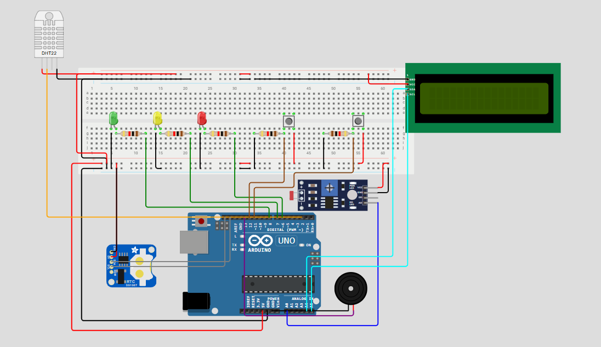
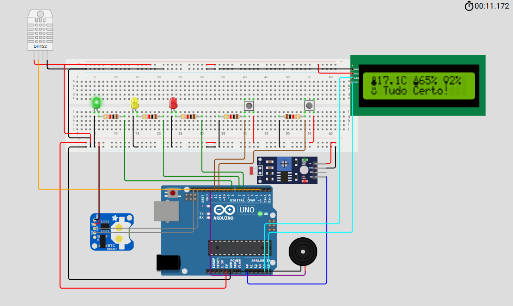
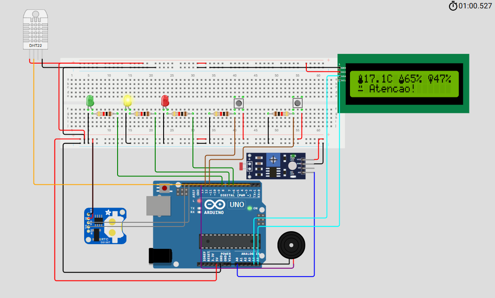
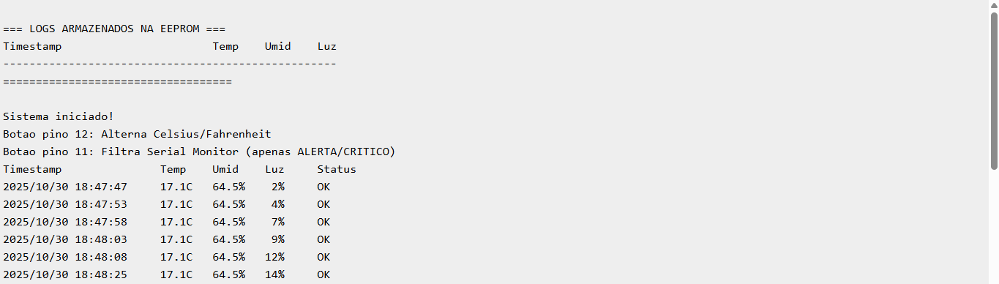
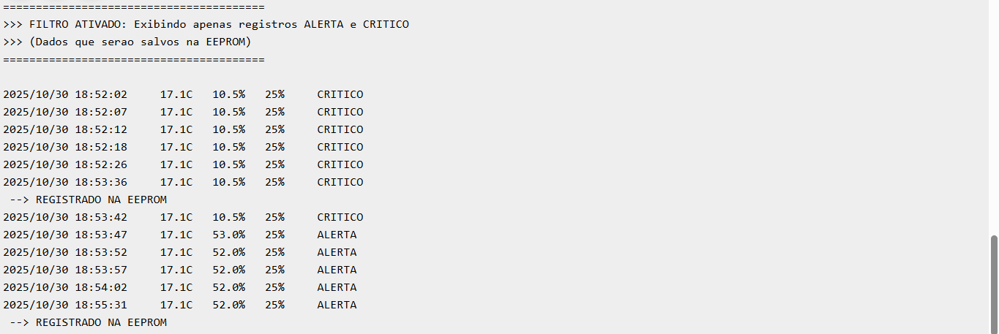

# Sistema de Monitoramento Completo para Vinheria

Sistema IoT desenvolvido para monitoramento em tempo real de **temperatura, umidade e luminosidade** em ambientes de armazenamento de vinhos, com data logger em EEPROM, interface visual avançada e **controles interativos**.

## 📋 Descrição do Projeto

Este projeto implementa um sistema completo de monitoramento para vinherias, com sensores de temperatura, umidade e luminosidade, além de funcionalidades interativas através de botões físicos para controle de unidade de temperatura e filtro do Serial Monitor.

## 🎯 Funcionalidades

### Monitoramento Completo
- ✅ **Temperatura**: Monitoramento via DHT22 (12-18°C ideal)
- ✅ **Umidade**: Controle de umidade relativa (60-80% ideal)
- ✅ **Luminosidade**: Sensor LDR com média móvel de 10 leituras (0-40% ideal)

### Sistema de Alertas Inteligente
- 🟢 **Estado OK**: Todos os parâmetros dentro dos limites ideais
- 🟡 **Estado ALERTA**: Parâmetros próximos aos limites críticos (LED amarelo + buzzer por 3s)
- 🔴 **Estado CRÍTICO**: Parâmetros muito fora dos limites (LED vermelho + buzzer por 3s)

### Data Logger com EEPROM
- 📝 Registro automático a cada 30 segundos quando em alerta ou crítico
- 💾 Armazena até 100 registros com timestamp completo
- 🔄 Sistema de buffer circular (sobrescreve registros mais antigos)
- 📊 Leitura de logs na inicialização (pode ser desativada via `LOG_OPTION`)

### Controles Interativos

#### 🌡️ **Botão de Alternância Celsius/Fahrenheit (Pino 12)**
- **Pressione e segure por pelo menos 50ms** para alternar entre °C e °F
- Alterna entre as unidades de temperatura em tempo real
- Conversão precisa usando a fórmula: °F = (°C × 9/5) + 32
- Sistema de **debounce** implementado (50ms) para evitar leituras duplicadas
- Atualização instantânea no LCD e Serial Monitor
- Estado persistente durante toda a sessão

#### 🔍 **Botão de Filtro do Serial Monitor (Pino 11)**
- **Pressione e segure por pelo menos 50ms** para alternar entre modos
- **Modo Normal** (padrão): Exibe todos os registros (OK, ALERTA, CRÍTICO)
- **Modo Filtrado**: Exibe apenas registros ALERTA e CRÍTICO
  - Útil para focar apenas nos dados que serão salvos na EEPROM
  - Reduz poluição visual no monitor serial
- Sistema de **debounce** implementado (50ms)
- Indicação clara do estado atual do filtro

### Interface Visual Avançada
- 🎨 **Ícones dinâmicos no LCD**: 
  - 🌡️ Termômetro que enche conforme a temperatura sobe
  - 💧 Gota que enche conforme a umidade aumenta
  - 💡 Lâmpada que acende conforme a luminosidade aumenta
- 😊 **Emojis de estado**: Feliz (OK), Sério (Alerta), Triste (Crítico)
- ✨ Animação de inicialização personalizada com logo da empresa
- 🔄 Atualização a cada 5 segundos

### Comunicação e Timestamp
- 🕐 RTC DS1307 com ajuste de fuso horário configurável (UTC-3 padrão)
- 📡 Monitor Serial com logs formatados e alinhados
- 📅 Timestamps precisos em todos os registros
- ⚙️ Opções de configuração via defines no código

## 🔧 Componentes Utilizados

### Hardware
| Componente | Quantidade | Função |
|------------|------------|--------|
| Arduino Uno R3 | 1 | Microcontrolador principal |
| DHT22 | 1 | Sensor de temperatura e umidade |
| LDR (Fotoresistor) | 1 | Sensor de luminosidade |
| RTC DS1307 | 1 | Relógio em tempo real |
| LCD 16x2 I2C | 1 | Display de informações |
| LED Verde | 1 | Indicador estado OK |
| LED Amarelo | 1 | Indicador estado alerta |
| LED Vermelho | 1 | Indicador estado crítico |
| Buzzer | 1 | Alarme sonoro (3 segundos) |
| Pushbutton | 2 | Controles interativos (pinos 11 e 12) |
| Resistor 220Ω | 3 | Limitador de corrente dos LEDs |
| Resistor 10kΩ | 2 | Pull-down dos botões |
| Protoboard | 1 | Montagem do circuito |
| Jumpers | Vários | Conexões |

### Software
- Arduino IDE
- Bibliotecas:
  - `Wire.h` - Comunicação I2C
  - `LiquidCrystal_I2C.h` - Controle do LCD I2C
  - `DHT.h` - Leitura do sensor DHT22
  - `RTClib.h` - Controle do RTC
  - `EEPROM.h` - Armazenamento de dados

## 📸 Visualização do Projeto

### Circuito no Wokwi



*Vista geral do circuito montado no Wokwi*

### Sistema em Funcionamento



*Sistema em estado OK - Todos os parâmetros dentro dos limites ideais*

---



*Sistema em estado de alerta - Parâmetros próximos aos limites críticos (LED amarelo + buzzer)*

---


*Sistema em estado crítico - Parâmetros muito fora dos limites (LED vermelho + buzzer)*

### Serial Monitor



*Serial monitor iniciado com informações dos botões*

---



*Serial monitor salvando registros na EEPROM*

## 📐 Diagrama de Conexões

### Pinagem do Arduino

**Sensores:**
```
DHT22:
- VCC → 5V
- GND → GND
- DATA → Pino 2

LDR:
- Um lado → 5V
- Outro lado → A0 + Resistor 10kΩ para GND

RTC DS1307:
- VCC → 5V
- GND → GND
- SDA → A4
- SCL → A5
```

**Display LCD I2C:**
```
- VCC → 5V
- GND → GND
- SDA → A4 (compartilhado com RTC)
- SCL → A5 (compartilhado com RTC)
```

**LEDs:**
```
- LED Verde → Pino 8 (+ resistor 220Ω para GND)
- LED Amarelo → Pino 7 (+ resistor 220Ω para GND)
- LED Vermelho → Pino 6 (+ resistor 220Ω para GND)
```

**Buzzer:**
```
- Positivo → Pino 13
- Negativo → GND
```

**Botões:**
```
Botão Celsius/Fahrenheit:
- Um lado → Pino 12
- Outro lado → 5V
- Resistor 10kΩ do Pino 12 para GND (pull-down)

Botão Filtro Serial:
- Um lado → Pino 11
- Outro lado → 5V
- Resistor 10kΩ do Pino 11 para GND (pull-down)
```

## 🚀 Como Executar

### No Simulador Wokwi
1. Acesse: [Link da Simulação no Wokwi](https://wokwi.com/projects/446065191320190977)
2. Clique em **"Start Simulation"**
3. Ajuste os valores dos sensores:
   - DHT22: Temperatura e umidade
   - LDR: Luminosidade
4. **Teste os botões interativos**:
   - **Pressione e segure** o botão do Pino 12 por ~50ms para alternar °C/°F
   - **Pressione e segure** o botão do Pino 11 por ~50ms para ativar/desativar filtro
5. Observe o comportamento dos LEDs, buzzer e display
6. Abra o **Serial Monitor** para ver os logs detalhados

### No Arduino Físico
1. Baixe os arquivos do repositório
2. Instale as bibliotecas necessárias (via Library Manager)
3. Abra o arquivo `sketch.ino` no Arduino IDE
4. Monte o circuito conforme o diagrama (não esqueça os resistores de pull-down!)
5. **Configure o código** (opcional):
   ```cpp
   #define LOG_OPTION 1      // 1 = Lê EEPROM na inicialização, 0 = Não lê
   #define SERIAL_OPTION 1   // 1 = Serial ativo, 0 = Serial desativado
   #define UTC_OFFSET -3     // Ajuste o fuso horário
   ```
6. **IMPORTANTE**: Na primeira vez, deixe esta linha ativa:
   ```cpp
   rtc.adjust(DateTime(F(__DATE__), F(__TIME__)));
   ```
7. Faça o upload do código
8. **Após o primeiro upload**, comente a linha acima e faça upload novamente
9. Abra o Monitor Serial (9600 baud) para ver os logs

## 💡 Como Funciona

### Sistema de Alternância de Temperatura
```cpp
Funcionamento do Botão (Pino 12):
1. Pressione e segure o botão por pelo menos 50ms
2. O sistema detecta a mudança de estado (debounce)
3. Alterna a flag usarFahrenheit (true/false)
4. Atualiza display e serial automaticamente
5. Conversão: °F = (°C × 9/5) + 32

Importante: Não basta um clique rápido - segure por ~50ms
Estado persistente durante toda a execução
```

### Sistema de Filtro do Serial Monitor
```cpp
Funcionamento do Botão (Pino 11):
1. Pressione e segure o botão por pelo menos 50ms
2. O sistema detecta a mudança de estado (debounce)
3. Alterna a flag filtrarSerial
4. Quando ATIVO: exibe apenas ALERTA e CRÍTICO
5. Quando INATIVO: exibe todos os registros (OK, ALERTA, CRÍTICO)

Importante: Não basta um clique rápido - segure por ~50ms
Útil para visualizar apenas dados que serão salvos na EEPROM
```

### Sistema de Média Móvel
O sensor LDR utiliza um algoritmo de **média móvel** com 10 leituras para eliminar ruídos:
```cpp
// A cada leitura:
1. Remove a leitura mais antiga do array
2. Adiciona a nova leitura
3. Calcula a média das 10 leituras
4. Converte para porcentagem (0-100%) usando map()
```

### Limites e Triggers

| Parâmetro | Ideal | Alerta | Crítico |
|-----------|-------|--------|---------|
| **Temperatura** | 12-18°C | 9-12°C ou 18-21°C | <9°C ou >21°C |
| **Umidade** | 60-80% | 50-60% ou 80-90% | <50% ou >90% |
| **Luminosidade** | 0-40% | 41-65% | >65% |

### Sistema de Data Logger
```
1. Verifica se passou 30 segundos desde último registro
2. Se estiver em ALERTA ou CRÍTICO:
   → Salva na EEPROM: timestamp + temperatura + umidade + luminosidade
   → Avança para próxima posição (buffer circular)
   → Exibe "REGISTRADO NA EEPROM" no Serial
3. Na inicialização (se LOG_OPTION = 1), lê e exibe todos os logs
```

### Ícones Dinâmicos
Os **ícones mudam dinamicamente** conforme os valores dos sensores:

**Termômetro 🌡️:**
- Vazio (abaixo de 12°C)
- Meio cheio (12-18°C) 
- Cheio (acima de 18°C)

**Gota 💧:**
- Vazia (abaixo de 60%)
- Meio cheia (60-80%)
- Cheia (acima de 80%)

**Lâmpada 💡:**
- Apagada (0-40%)
- Meia luz (41-65%)
- Acesa (acima de 65%)

## 📊 Saída do Monitor Serial

### Inicialização
```
=== LOGS ARMAZENADOS NA EEPROM ===
Timestamp                    Temp    Umid    Luz
---------------------------------------------------
2024-11-01T16:31:10         20.5C   65.2%   45%
2024-11-01T16:32:05         22.3C   68.0%   78%
===================================

Sistema iniciado!
Botao pino 12: Alterna Celsius/Fahrenheit
Botao pino 11: Filtra Serial Monitor (apenas ALERTA/CRITICO)
Timestamp           Temp    Umid    Luz    Status
```

### Modo Normal (Filtro Desativado)
```
2024/10/30 16:31:29  15.0C   61.0%   8%    OK
2024/10/30 16:31:34  15.2C   62.0%  12%    OK
2024/10/30 16:31:39  16.0C   61.0%  45%    ALERTA
 --> REGISTRADO NA EEPROM
2024/10/30 16:31:44  22.0C   61.0%  78%    CRITICO
 --> REGISTRADO NA EEPROM
```

### Modo Filtrado (Apenas ALERTA/CRÍTICO)
```
========================================
>>> FILTRO ATIVADO: Exibindo apenas registros ALERTA e CRITICO
>>> (Dados que serao salvos na EEPROM)
========================================

2024/10/30 16:31:39  16.0C   61.0%  45%    ALERTA
 --> REGISTRADO NA EEPROM
2024/10/30 16:31:44  22.0C   61.0%  78%    CRITICO
 --> REGISTRADO NA EEPROM
```

### Alternância de Temperatura
```
>>> Unidade alterada para: FAHRENHEIT
2024/10/30 16:32:10  59.0F   61.0%  45%    ALERTA

>>> Unidade alterada para: CELSIUS
2024/10/30 16:32:15  15.0C   61.0%  45%    ALERTA
```

## 🎨 Interface LCD

**Tela de Boas-vindas:**
```
🍃 Vinharia  🍃
🍇  Agnello  🍇
[Barra de progresso animada]
```

**Tela de Monitoramento (Celsius):**
```
🌡️15.5C 💧70% 💡35%
😊 Tudo Certo!
```

**Tela de Monitoramento (Fahrenheit):**
```
🌡️59.9F 💧70% 💡35%
😊 Tudo Certo!
```

**Estados Possíveis:**
- `😊 Tudo Certo!` - Ambiente OK
- `😐 Atencao!` - Alerta
- `☹️ Critico!` - Situação crítica

## 🎓 Conceitos Aplicados

### Hardware
- ✅ Sensores analógicos (LDR) e digitais (DHT22)
- ✅ Protocolo I2C (LCD e RTC)
- ✅ Debouncing de botões
- ✅ Pull-down resistors
- ✅ Controle de buzzer
- ✅ Multiplexação de LEDs

### Software
- ✅ Média móvel (filtro digital)
- ✅ Máquina de estados (OK/ALERTA/CRÍTICO)
- ✅ Buffer circular (EEPROM)
- ✅ Manipulação de timestamps
- ✅ Conversão de unidades (Celsius ↔ Fahrenheit)
- ✅ Debouncing por software
- ✅ Flags de controle
- ✅ Formatação de strings
- ✅ Caracteres customizados LCD

## 🔧 Troubleshooting

### Problema: Botões não respondem
- ✅ Verifique os resistores de pull-down (10kΩ)
- ✅ Confirme as conexões dos pinos 11 e 12
- ✅ **Pressione e segure os botões por pelo menos 50ms** (não apenas clique rápido)
- ✅ Teste os botões individualmente

### Problema: Temperatura sempre em Fahrenheit
- ✅ A flag inicia em Celsius (false)
- ✅ Pressione o botão do pino 12 para alternar

### Problema: Serial Monitor muito poluído
- ✅ Pressione o botão do pino 11 para ativar o filtro
- ✅ Isso mostrará apenas registros ALERTA/CRÍTICO

### Problema: RTC não mantém horário
- ✅ Verifique se o RTC tem bateria
- ✅ Faça o ajuste inicial com `rtc.adjust()`
- ✅ Comente a linha após o primeiro upload

### Problema: LCD não exibe nada
- ✅ Verifique o endereço I2C (padrão: 0x27)
- ✅ Ajuste o contraste do LCD
- ✅ Confirme conexões SDA e SCL

## 📚 Recursos Adicionais

- [Documentação DHT22](https://www.arduino.cc/reference/en/libraries/dht-sensor-library/)
- [Biblioteca RTClib](https://github.com/adafruit/RTClib)
- [LCD I2C Tutorial](https://www.arduino.cc/reference/en/libraries/liquidcrystal-i2c/)
- [EEPROM Arduino](https://www.arduino.cc/en/Reference/EEPROM)
- [Debouncing Buttons](https://www.arduino.cc/en/Tutorial/BuiltInExamples/Debounce)

## 👥 Autores

- **João Victor (RM: 566640)**
- **Gustavo Macedo (RM: 567594)**
- **Gustavo Hiruo (RM: 567625)**
- **Yan Lucas (RM: 567046)**

Projeto FIAP - Vinheria Agnello

## 📄 Licença

Este projeto foi desenvolvido para fins educacionais como parte do curso da FIAP.

## 🔗 Links

- [Simulação no Wokwi](https://wokwi.com/projects/446065191320190977)
- [Vídeo explicativo]()

---

**Data de desenvolvimento**: Outubro 2024